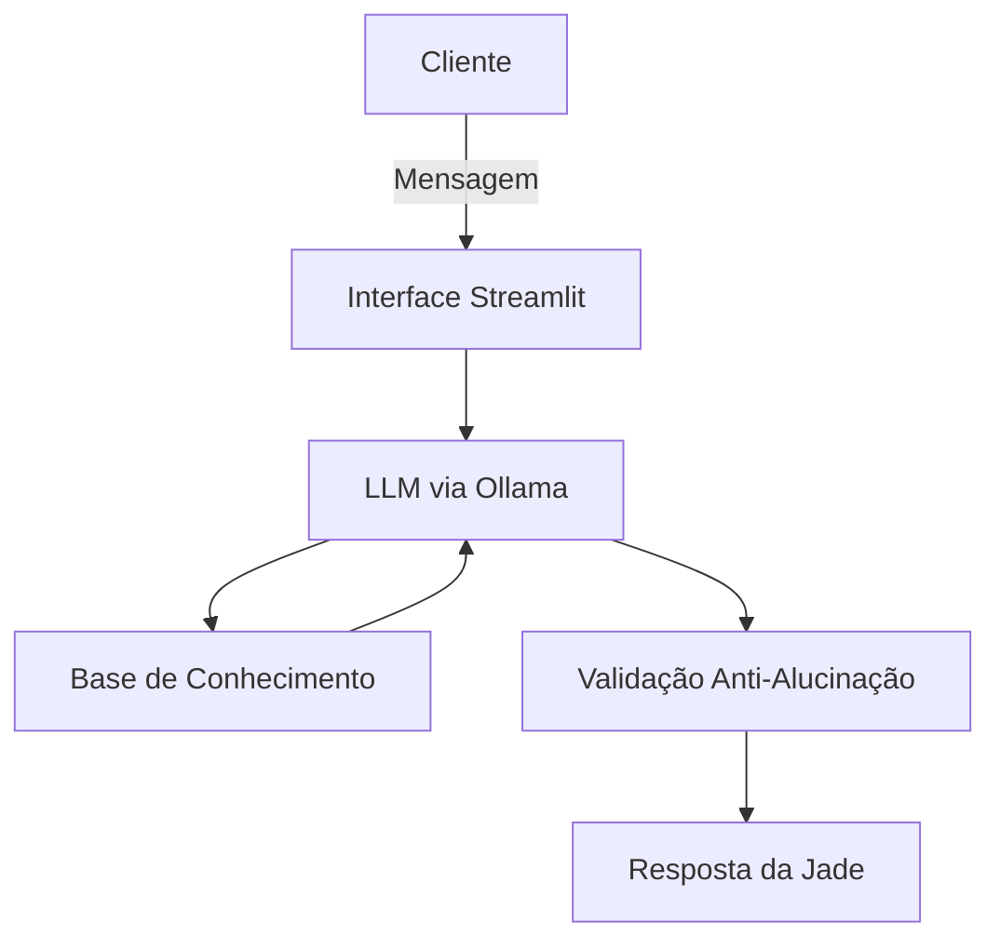

## 💚 Jade — Sua Educadora Financeira com IA

> *"Sou a Jade, sua educadora financeira. Vou te explicar sobre finanças como uma amiga!"*


---

## 🧠 O que é a Jade?

A **Jade** é uma agente de IA educacional voltada para **finanças pessoais**. Ela foi criada para ajudar pessoas que têm dificuldades com conceitos financeiros básicos — como reserva de emergência, tipos de investimentos e organização de gastos — de forma simples, personalizada e acessível.

Diferente de um consultor financeiro tradicional, a Jade **não recomenda investimentos**. Ela **ensina** como eles funcionam, usando os próprios dados do cliente como exemplos práticos e didáticos. Pense nela como uma professora particular jovem e descontraída, que fala a sua língua.

---

## 🎯 Problema que resolve

Muitas pessoas têm dinheiro parado, dívidas acumuladas ou simplesmente não sabem como começar a investir — não por falta de interesse, mas por falta de **educação financeira acessível**. Conteúdos sobre finanças costumam ser técnicos demais, genéricos demais ou fora da realidade do usuário.

A Jade resolve isso ao combinar:
- Linguagem simples e informal (como uma conversa de verdade)
- Contexto personalizado com os dados reais do usuário
- Postura educativa, nunca prescritiva

---

## ✨ Funcionalidades

- **Explicações personalizadas** — usa o perfil, histórico de transações e atendimentos anteriores do cliente para contextualizar as respostas
- **Educação sem julgamento** — explica conceitos como CDI, Selic, Tesouro Direto, FIIs e Renda Fixa de forma descomplicada
- **Análise de gastos didática** — mostra padrões de consumo e explica estratégias de organização
- **Limites éticos bem definidos** — não recomenda investimentos, não acessa dados sensíveis e admite quando não sabe algo
- **Foco no escopo** — redireciona perguntas fora do tema de finanças pessoais de forma educada

---

## 🏗️ Arquitetura



| Componente | Tecnologia |
|---|---|
| Interface | [Streamlit](https://streamlit.io/) |
| LLM | [Ollama](https://ollama.ai/) (`gpt-oss:20b`) |
| Base de Conhecimento | JSON e CSV injetados no contexto |
| Linguagem | Python |

---

## 🗃️ Base de Conhecimento

A Jade utiliza quatro fontes de dados do cliente para personalizar suas respostas:

| Arquivo | Formato | Função |
|---|---|---|
| `perfil_investidor.json` | JSON | Perfil, renda, objetivos e metas do cliente |
| `transacoes.csv` | CSV | Histórico de transações para análise de gastos |
| `historico_atendimento.csv` | CSV | Contexto de interações anteriores |
| `produtos_financeiros.json` | JSON | Produtos disponíveis para ensino (Tesouro Selic, CDB, LCI/LCA, FII, Fundo de Ações) |

> Os dados são injetados diretamente no prompt, garantindo que a Jade tenha o contexto completo do cliente a cada conversa.

---

## 🛡️ Segurança e Anti-Alucinação

A Jade foi projetada com responsabilidade em mente:

- ✅ Usa **apenas os dados fornecidos** no contexto — sem inventar informações
- ✅ **Nunca recomenda investimentos específicos** — apenas explica como funcionam
- ✅ **Admite limitações** com transparência: *"Não tenho essa informação, mas posso explicar..."*
- ✅ **Não acessa dados sensíveis** (senhas, dados de terceiros, etc.)
- ✅ **Foca exclusivamente em educação financeira** — recusa perguntas fora do escopo

---

## 💬 Exemplos de Interação

**Pergunta conceitual:**
> 🧑 "O que é um CDI?"
>
> 💚 Jade: *"CDI é uma taxa de referência usada pelos bancos. Quando um investimento rende '100% do CDI', significa que ele acompanha essa taxa. Hoje o CDI está próximo da Selic. Quer que eu explique a diferença entre os dois?"*

**Análise de gastos:**
> 🧑 "Onde estou gastando mais?"
>
> 💚 Jade: *"Olhando suas transações de outubro, sua maior despesa é moradia (R$ 1.380), seguida de alimentação (R$ 570). Juntas, representam quase 80% dos seus gastos. Isso é bem comum! Quer que eu explique algumas estratégias de organização?"*

**Pergunta fora do escopo:**
> 🧑 "Qual a previsão do tempo para amanhã?"
>
> 💚 Jade: *"Sou especializada em finanças e não tenho informações sobre previsão do tempo. Posso ajudar com algo relacionado às suas finanças?"*

---

## 🚀 Como Rodar

### Pré-requisitos

- Python 3.8+
- [Ollama](https://ollama.com) instalado

### Passo a passo

```bash
# 1. Baixar o modelo
ollama pull gpt-oss

# 2. Garantir que o Ollama está rodando
ollama serve

# 3. Instalar dependências Python
pip install streamlit pandas requests

# 4. Rodar a aplicação
streamlit run ./src/app.py        # Linux/Mac
streamlit run .\src\app.py        # Windows
```

Acesse em `http://localhost:8501` 🎉

---

## 📁 Estrutura do Repositório

```
📁 JadeAI/
│
├── 📄 README.md
│
├── 📁 data/
│   ├── perfil_investidor.json
│   ├── produtos_financeiros.json
│   ├── transacoes.csv
│   └── historico_atendimento.csv
│
├── 📁 src/
│   └── app.py
│
├── 📁 assets/
│   └── image.png
│
└── 📁 docs/
    ├── 01-documentacao-agente.md
    ├── 02-base-conhecimento.md
    ├── 03-prompts.md
    ├── 04-metricas.md
    └── 05-pitch.md
```

---

## 🧪 Métricas de Qualidade

| Métrica | O que avalia |
|---|---|
| **Assertividade** | A Jade respondeu corretamente ao que foi perguntado? |
| **Segurança** | Evitou inventar informações fora do contexto? |
| **Coerência** | A resposta faz sentido para o perfil do cliente? |

---

## 🔮 Próximos Passos

- [ ] Carregamento dinâmico dos dados (substituir injeção estática no prompt)
- [ ] Suporte a múltiplos perfis de cliente
- [ ] Histórico de conversa persistente na sessão
- [ ] Observabilidade com ferramentas como [LangWatch](https://langwatch.ai/) ou [LangFuse](https://langfuse.com/)
- [ ] Interface mais rica com gráficos de gastos

---

## 👨‍💻 Autor

Desenvolvido por **Thiago Sousa Delphino** como projeto de agente financeiro com IA Generativa.

---

> ⚠️ **Aviso:** A Jade é uma ferramenta educacional. Ela não substitui um profissional certificado em finanças. Sempre consulte um especialista antes de tomar decisões financeiras importantes.