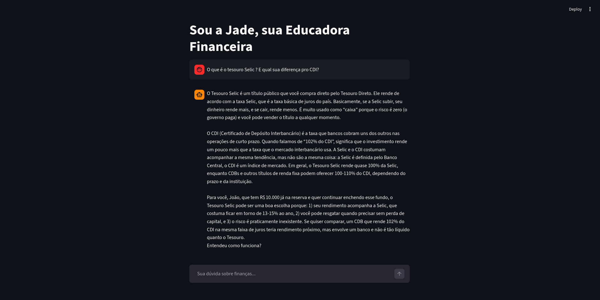

# Passo a passo da execução

Esta pasta contém o código do seu agente financeiro.

## Setup Ollama

```bash
# 1. Instalar Ollama(ollama.com)
# 2. Baixar um modelo leve
ollama pull gpt-oss

# 3. Testar funcionamento
ollama run gpt-oss:20b "Olá"
```

## Código completp

Todo o código-fonte está no arquivo "app.py".

## Como Rodar

```bash
# 1. Instalar dependências
pip install streamlit panda requests

# 2. Garantir que Ollama está rodando
ollama serve

#3. Rodar o app
streamlit run .\src\app.py #Em linux usar ./src/app.py
```
## Evidência de Execução

